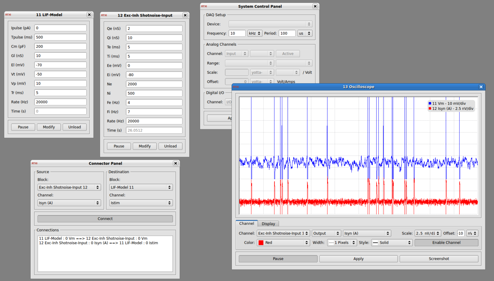

### Emulating synaptic bombardment in 

#### Conductance-based currents relying on excitatory and inhibitory shotnoise processes

**Requirements:** None  
**Limitations:** None  

<!--start-->

This module aims at reproducing the synaptic bombardment targetting a single cell in cortical networks. The currents are based on Poisson point processes convoluted with exponential waveforms. For the rationale of such models and similar dynamic-clamp implementation (for in-vitro experiments), see e.g. the (non-exhaustive) following publications :

- (http://www.jneurosci.org/content/24/10/2345.long)
- (http://www.ncbi.nlm.nih.gov/pubmed/12194875)
- (http://www.ncbi.nlm.nih.gov/pubmed/21389243)
- (http://onlinelibrary.wiley.com/doi/10.1113/JP272317/abstract)

The config file producing the snapshot (i.e. combined with my LIF-model implementation) can be found on this 

<!--end-->

####Parameters

see GUI 

